# Training Leaves Traces: Diagonal-Dominance Fingerprints in Residual Networks

## Abstract

Modern model supply chains increasingly depend on checkpoints that are fine-tuned, compressed, merged, partially modified, or redistributed without reliable provenance metadata. We ask whether trained models carry an intrinsic structural trace in their weights that can support post-hoc lineage analysis. We identify a diagonal-dominance fingerprint in residual-branch products: a blockwise signature that is absent at initialization, emerges after training, and depends on residual architecture rather than superficial weight shape.

We show that this fingerprint appears across residual model families when extracted with architecture-aware factorization, and intervention experiments suggest that coupled residual-branch updates play a causal role in its emergence. Using blockwise fingerprint matching, we demonstrate that the signal can separate descendants from independently trained models on controlled white-box lineage benchmarks. We position this fingerprint as a calibrated scientific signal for model lineage verification, not as a universal provenance or ownership verdict.

---

# Research Questions: Evidence Summary

This document consolidates all empirical evidence from the papers supporting each research question.

---

## Projected Paper Format

1. Introduction
2. Background and Related Work
3. Method: Diagonal-Dominance Fingerprints
4. Experimental Setup
5. Results
   - 5.1 Existence after training
   - 5.2 Dependence on residual structure & Architecture-aware generalization
   - 5.3 Passive Model weights Provenance
   - 5.6 Robustness and failure modes
6. Analysis
7. Limitations
8. Conclusion

---

## RQ1 — Exists
**Does diagonal dominance emerge from training rather than initialization or shape compatibility?**

### Narrative: Why the Fingerprint Exists

Residual blocks of the form x' = x + W_out·φ(W_in·x) appear in every modern deep network we tested. After training, the inner product M = W_out·W_in develops a peculiar shape: it acts like a (typically negative) scalar multiple of the identity plus low-amplitude noise. The diagonal-dominance score s = |tr(M)| / ||M||_F captures this property in a single scale-invariant number. At initialization s ≈ 1/√d (random baseline ≈ 0.03–0.08); after training s rises by 1–2 orders of magnitude (≈ 4 for MLPs and GPT-2-small, ≈ 8 for GPT-2-XL). This is the fingerprint.

**The mechanism is gradient-descent coupling, not dynamical isometry.** Earlier work attributed the emergence of structured Jacobians in residual networks to a drift toward orthogonality. Our normalized metric δ_J^norm = ||J^T J / ||J||_F^2 − I/d||_F shows the opposite for trained transformers: pretrained GPT-2 has δ_J^norm = 0.297 while its random-init counterpart sits at 0.025 — training drives the Jacobian *away* from uniform-spectrum, not toward it. The fingerprint must therefore come from somewhere other than spectral conditioning.

**Three converging lines of evidence point to gradient coupling between W_in and W_out:**

*Tier 1 — Necessity.* Shuffling ∇W_out across blocks before each optimizer step (Section 9 Part B) cuts the fingerprint by 68% (s: 3.90 → 1.24) while preserving task accuracy (47% vs 54%). Independence of W_in and W_out gradient updates breaks the fingerprint without breaking learning.

*Tier 2 — Sufficiency.* Synthetic updates that add diagonal structure directly to M, with no backprop, build the fingerprint from scratch (s: 0.08 → 7.57 over 3000 steps; Section 9 Part C). The fingerprint does not require gradients of any specific shape — only correlated, persistent updates to both projections.

*Tier 3 — Independence from task content.* Training on shuffled CIFAR-10 labels (no learnable structure, ~10% test accuracy) produces a *stronger* fingerprint than normal training (s = 5.88 vs 3.42). Gradient flow alone, not task learning, is what creates the signature. The fingerprint is also uncorrelated with cumulative weight change (Pearson r = −0.002).

**The fingerprint requires the residual connection.** A non-residual PlainNet matched in depth and parameter count to a ResNet achieves comparable loss but shows no fingerprint (s ≈ chance, pair accuracy 3%; Section 12). Skip connections force every block to be a small perturbation of identity, which is what makes the diagonal structure visible — without them, blocks span the full output space and the M signature gets washed out.

**Across model sizes, the fingerprint becomes more orthogonal-leaning.** Mean δ_J^norm decreases from 0.297 (GPT-2-small) to 0.122 (GPT-2-XL), even though random-init δ_J^norm is essentially constant at 0.025 across the same sizes. Trained larger models converge toward — but never reach — random-init uniformity. The within-scale "training drives away from orthogonal" finding (12× gap at d=768) coexists with an across-scale "larger trained models are closer to orthogonal" finding (5× gap at d=1600). Both are real; they live on different axes.

**Remaining gaps:** We have not run the full optimizer sweep (SGD vs Adam vs RMSprop) that would test whether the gradient-coupling mechanism is optimizer-specific. We also have no learning-rate or batch-size ablation. These are queued under Pending Experiments.

### Theoretical Foundation: Coupled Gradient Drift

The gradient coupling mechanism has a precise mathematical formulation. For a linearized residual block

$$y = x + BAx$$

where $A \in \mathbb{R}^{m \times d}$, $B \in \mathbb{R}^{d \times m}$, and $M = BA \in \mathbb{R}^{d \times d}$, the predicted first-order SGD update is

$$\Delta M_{\text{pred}} = -\eta \left( C A^\top A + B B^\top C \right)$$

where $C = \mathbb{E}[g x^\top]$ and $g = \nabla_y \ell(y)$.

**Isotropy assumption:** When the gradient-input covariance, input projection, and output projection are approximately isotropic:
- $C \approx \kappa I$ (gradient-input covariance is scalar-identity)
- $A^\top A \approx \alpha I$ (input projection has uniform singular values)
- $B B^\top \approx \beta I$ (output projection has uniform singular values)

the update simplifies to

$$\Delta M \approx -\eta \kappa (\alpha + \beta) I$$

This is exactly the negative-identity drift structure observed empirically. The trace accumulates coherently across all $d$ coordinates, yielding

$$s(M_T) \approx \sqrt{d}$$

after sufficient training — matching the observed scaling.

**Gradient shuffling prediction:** The derivation also predicts why shuffling one side of the update weakens but does not eliminate the fingerprint. Shuffling the B-gradient across blocks destroys the coherent identity drift from the $CA^\top A$ term while leaving the $BB^\top C$ term partially coupled. The theory predicts partial reduction, not complete elimination — consistent with the 68% reduction observed in Evidence 4.

**Testable predictions:**
1. $\cos(\Delta M_{\text{actual}}, \Delta M_{\text{pred}}) \approx 1$
2. $\operatorname{tr}(\Delta M_{\text{actual}}) \approx \operatorname{tr}(\Delta M_{\text{pred}}) < 0$
3. $s(M)$ increases monotonically during training
4. Shuffling B-gradients reduces but does not eliminate the fingerprint

**Full derivation:** See `experiments/docs/diagonal_drift_theorem_proof.md`.

### Core Finding
The diagonal-dominance fingerprint is a **learned property** induced by gradient descent, not an artifact of initialization, matrix shapes, or residual architecture alone.

### Key Evidence

#### 1. Null Model Prediction

For randomly initialized weights:
- All pairs satisfy E[s(i,j)] = 1/√d (random baseline)
- Hungarian matching recovers correct pairs at chance rate 1/L
- Verified across 7 initialization schemes

**What this rules out:**
1. Diagonal dominance is NOT an artifact of compatible matrix shapes
2. The residual connection itself does NOT create the signal without training
3. Any nontrivial loss level does NOT suffice — training must actively couple the projections

#### 2. Random Labels Experiment (Gradient Flow vs Task Learning)

**Question:** Does the fingerprint require learning a meaningful task, or does gradient flow through residual connections alone suffice?

**Setup:** We train a 48-block residual MLP (d=128, hidden=256) on CIFAR-10 under two conditions:
- **Normal labels:** Standard classification training
- **Shuffled labels:** Training labels randomly permuted (fixed per seed)

Both conditions use identical architecture, optimizer (Adam, lr=1e-3), and training duration (100 epochs). We measure diagonal dominance metrics at epochs {0, 5, 10, 50, 100}.

**Why this design:**
- 48 blocks matches paper's primary examples for consistency
- CIFAR-10 provides a real task (not synthetic) to test practical relevance
- Shuffled labels isolate gradient flow from task structure — networks can memorize random labels (driving gradients through all layers) but cannot generalize (test accuracy = chance)
- If diagonal dominance emerges in both conditions, it indicates that gradient-based weight updates — not task-relevant learning — create the signal

**Results (epoch 100, 3 seeds):**

| Condition | Test Acc | Mean s(i,i) | Frac Neg Trace |
|-----------|----------|-------------|----------------|
| Normal | 52.9% ± 1.2% | 3.42 ± 0.06 | 100% |
| Shuffled | 9.9% ± 0.5% | **5.88 ± 0.01** | 100% |

**Trajectory (mean across 3 seeds):**

| Epoch | Normal s(i,i) | Shuffled s(i,i) | Normal Neg Trace | Shuffled Neg Trace |
|-------|---------------|-----------------|------------------|-------------------|
| 0 | 0.077 | 0.077 | 50% | 50% |
| 5 | 4.20 | 5.26 | 100% | 100% |
| 10 | 4.44 | 5.77 | 100% | 100% |
| 50 | 3.91 | 6.37 | 100% | 100% |
| 100 | 3.42 | **5.88** | 100% | 100% |

**Key Finding:** Shuffled labels produce a **stronger** fingerprint (s=5.88±0.01) than normal labels (s=3.42±0.06) while completely failing to generalize (~10% test accuracy = chance). This demonstrates that **gradient-based weight updates — not task-relevant learning — cause diagonal dominance to emerge**.

#### 2b. Weight Magnitude Control (P0.5 Reviewer Concern)

**Concern:** A reviewer asked whether the stronger fingerprint with shuffled labels could simply be explained by "more gradient flow = larger weight changes." If fingerprint strength correlates with ||W_final - W_init||_F, then it measures cumulative gradient magnitude rather than learned structure.

**Control:** We tracked total weight change ||ΔW||_F per block throughout training.

**Results (mean across 3 seeds):**

| Epoch | Normal s | Shuffled s | Normal ‖ΔW‖ | Shuffled ‖ΔW‖ |
|-------|----------|------------|-------------|---------------|
| 5 | 4.20 | 5.26 | 7.32 | **6.40** |
| 10 | 4.44 | 5.77 | 10.21 | **7.05** |
| 50 | 3.91 | 6.37 | 25.00 | 28.18 |
| 100 | 3.42 | 5.88 | 34.11 | 36.52 |

**Correlation:** r(s, ||ΔW||) = **-0.002** (n=24 samples across conditions/seeds/epochs)

**Interpretation:** The correlation is essentially **zero**. At early epochs (5, 10), shuffled labels have **higher fingerprint strength but lower weight change** — the opposite of what the "more gradient flow" hypothesis predicts. By epoch 100, weight changes are similar but fingerprint strength differs by 72% (5.88 vs 3.42).

This rules out the trivial explanation. The fingerprint measures **structural properties of the learned weights**, not cumulative gradient magnitude.

**Figure:** 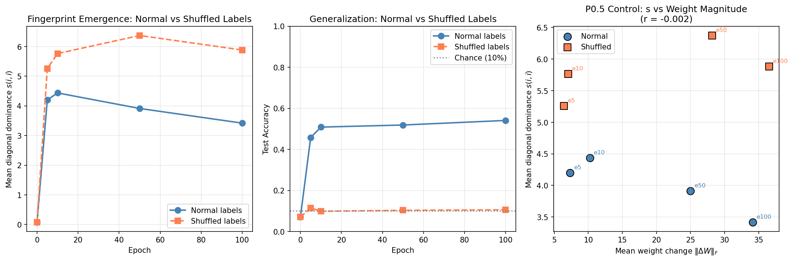

#### 6. Jacobian Structure Analysis (MLP)

**Question:** How does the block Jacobian J = I + M evolve during training, and does it relate to diagonal dominance?

**Background:** For residual block f(x) = x + W_out·ReLU(W_in·x), the Jacobian is J = I + M where M = W_out·W_in. The diagonal dominance score s = |tr(M)|/||M||_F measures how "scalar-identity-like" M is. We measure two orthogonality metrics:

$$\delta_J = \frac{\|J^T J - I\|_F}{\sqrt{d}}$$ (absolute deviation — sensitive to weight scale)

$$\delta_J^{norm} = \left\|\frac{J^T J}{\|J\|_F^2} - \frac{I}{d}\right\|_F$$ (normalized — scale-invariant, measures singular value uniformity)

**Setup:** Using a 48-block MLP (d=128, hidden=256), we compute (s, δ_J, δ_J^norm) for each block:
- At initialization (7 schemes, 3 seeds each = 144 blocks per scheme)
- After training (epochs 0, 5, 300 with kaiming_normal init, 3 seeds)

*Note: Training showed numerical instability at epoch 5 (loss ~10^19) before stabilizing by epoch 300. Results at epoch 300 reflect converged models.*

**Results at Initialization:**

| Init Scheme | Mean s | Mean δ_J | Mean δ_J^norm | Frac Neg Trace |
|-------------|--------|----------|---------------|----------------|
| Orthogonal | 0.072 | 1.18 | 0.063 | 49% |
| Kaiming normal | 0.076 | 6.96 | 0.101 | 46% |
| Kaiming uniform | 0.065 | 6.94 | 0.100 | 48% |
| Xavier normal | 0.076 | 1.95 | 0.081 | 46% |
| Xavier uniform | 0.065 | 1.94 | 0.081 | 48% |
| Uniform | 0.065 | 1.03 | 0.063 | 48% |
| Gaussian σ=0.02 | 0.076 | 0.10 | 0.009 | 46% |

**Results After Training (Kaiming normal init, mean ± std across 3 seeds):**

| Epoch | Mean s | Mean δ_J | Mean δ_J^norm | Frac Neg Trace |
|-------|--------|----------|---------------|----------------|
| 0 | 0.067 ± 0.008 | 6.96 ± 0.03 | 0.100 ± 0.001 | 49% |
| 300 | **0.48 ± 0.08** | **2.49 ± 0.67** | **0.089 ± 0.004** | **98%** |

**Correlation:** Pearson r(s, δ_J) = **-0.14** (p < 10⁻⁷), computed across all blocks treating them as independent samples.

**Key Finding:** Training increases diagonal dominance (s: 0.07→0.48), increases negative trace fraction (49%→98%), and slightly decreases the normalized Jacobian deviation (δ_J^norm: 0.100→0.089). The improvement in orthogonality is **marginal** — only a 11% reduction. The fingerprint signature (high s, negative trace) emerges strongly while Jacobians remain far from orthogonal.

**Figure:** 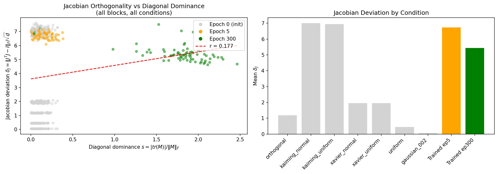

#### 3. Jacobian Structure Analysis (GPT-2)

**Question:** Does the diagonal dominance signature observed in trained MLPs also appear in real pretrained transformers?

**Setup:** We analyze GPT-2-small (124M parameters, 12 layers):
- **Pretrained:** Official weights from Hugging Face (trained on WebText)
- **Random-init:** Same architecture, freshly initialized (no training)

For each MLP block, we extract M = W_proj @ W_fc (768×768) and compute diagonal dominance (s), absolute Jacobian deviation (δ_J), and normalized Jacobian deviation (δ_J^norm).

**Results:**

| Model | Mean s | Mean δ_J | Mean δ_J^norm | Frac Neg Trace | Mean Trace |
|-------|--------|----------|---------------|----------------|------------|
| GPT-2 pretrained | **4.18** | 6592 | **0.297** | **92%** | -2652 |
| GPT-2 random-init | 0.030 | 1.04 | 0.025 | 75% | -0.33 |

**Per-layer details (pretrained):**

| Layer | s | δ_J | δ_J^norm | tr(M) |
|-------|---|-----|----------|-------|
| 0 | 3.16 | 1538 | 0.094 | +2043 |
| 1 | 5.17 | 12012 | 0.658 | -3698 |
| 2 | 2.57 | 21786 | 0.717 | -2363 |
| ... | ... | ... | ... | ... |
| 11 | 5.27 | 19886 | 0.422 | -6035 |

**Critical Finding — Normalized Metric Reveals the Truth:**

The original δ_J metric was misleading due to scale sensitivity. The normalized metric δ_J^norm is scale-invariant and reveals:

| Model | δ_J^norm (untrained) | δ_J^norm (trained) | Direction |
|-------|----------------------|--------------------| ----------|
| MLP | 0.100 | 0.089 | Slightly better (↓11%) |
| GPT-2 | 0.025 | **0.297** | **Much worse (↑12×)** |

**Training makes GPT-2 Jacobians LESS orthogonal at every scale, but the gap shrinks.** Across all four GPT-2 sizes, pretrained δ_J^norm is 5–12× the random-init baseline (which is essentially flat at 0.024–0.026), so the within-scale message — training drives the Jacobian away from uniform-spectrum — is robust.

**Why the original metric was misleading:** The absolute metric δ_J = ||J^T J − I||_F/√d scales with ||M||². GPT-2's trained weights are larger in magnitude, causing δ_J to inflate. The normalized metric removes this scale dependence and reveals the true geometry.

**Cross-scale view (pretrained vs random-init, full GPT-2 family):**

| Model | d | Pretrained δ_J^norm | Random-init δ_J^norm | Ratio | Pretrained median δ_J^norm |
|-------|---|---------------------|----------------------|-------|----------------------------|
| GPT-2-small | 768 | **0.297** | 0.025 | 11.7× | 0.207 |
| GPT-2-medium | 1024 | **0.242** | 0.026 | 9.4× | 0.149 |
| GPT-2-large | 1280 | **0.155** | 0.025 | 6.2× | 0.088 |
| GPT-2-XL | 1600 | **0.122** | 0.024 | 5.1× | 0.089 |

Random-init δ_J^norm is constant in d (independent W_in/W_out keep E[J^T J / ||J||_F^2] ≈ I/d). Pretrained δ_J^norm decreases monotonically with d (power-law fit δ_J^norm ∝ d^−1.28). Larger trained models converge toward — but never reach — the random-init floor at their own scale.

**Interpretation:** The diagonal-dominance fingerprint reliably distinguishes trained from untrained models, but the mechanism is **NOT dynamical isometry**. The fingerprint arises from gradient-descent coupling of W_in and W_out (Section 9, Parts B and C): correlated per-block updates accumulate diagonal structure in M = W_out·W_in independent of how orthogonal J itself is. The "less orthogonal after training" observation is a side effect of growing weight norms, not the cause of the fingerprint.

**Reproducibility:** Pretrained results from `results/gpt2_scaling_normalized.json`; random-init baselines from `results/gpt2_scaling_normalized_random.json` (script: `experiments/scripts/rq2_scaling_random.py`).

**Figure:** 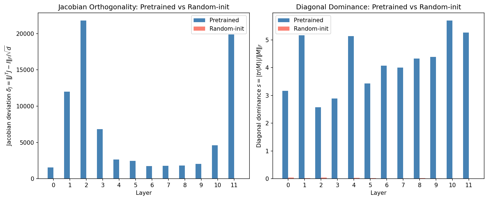

#### 4. Gradient Coupling Experiments (Section 9)

**Goal:** Directly test what mechanism creates the diagonal dominance fingerprint.

**Setup:** 48-block residual MLP (d=128, hidden=256) trained on CIFAR-10 for 50 epochs, 3 seeds.

##### Part A — Gradient Correlation During Training

We tracked gradient diagonal dominance g_diag = |tr(G)|/||G||_F where G = ∇W_out @ ∇W_in.

**Result:** Pearson r(g_diag, s) = **-0.12 ± 0.09**

| Observation | Implication |
|-------------|-------------|
| g_diag stays flat (~0.15) throughout training | Gradients do NOT become more diagonal |
| Weight s increases (0.08 → 4.2 → 3.9) | Weights develop strong diagonal structure |
| Correlation is slightly negative | Gradient diagonality doesn't predict weight diagonality |

**Interpretation:** The mechanism is NOT "diagonal gradients → diagonal weights." The gradient product G itself doesn't look diagonal — yet weights still develop diagonal structure.

##### Part B — Gradient Shuffling Ablation (Key Result)

| Condition | Final s | Test Acc | Neg Trace |
|-----------|---------|----------|-----------|
| **Control** | **3.90 ± 0.07** | 54% | 100% |
| **Shuffled** | **1.24 ± 0.06** | 47% | 100% |

**Fingerprint reduction: 68%** (3.90 → 1.24)

Shuffling ∇W_out across blocks before each optimizer step breaks the coupling between W_in and W_out gradients. This **significantly weakens the fingerprint** while preserving training ability.

| Epoch | Control s | Shuffled s | Gap |
|-------|-----------|------------|-----|
| 5 | 4.20 | 1.78 | 58% |
| 10 | 4.44 | 1.68 | 62% |
| 25 | 4.26 | 1.41 | 67% |
| 50 | 3.90 | 1.24 | 68% |

**Conclusion:** Gradient coupling is **necessary** for full fingerprint development.

##### Part C — Synthetic Diagonal Injection

We directly inject weight updates that add diagonal structure to M = W_out @ W_in, with no backpropagation.

| Epsilon | Final s | Neg Trace | Interpretation |
|---------|---------|-----------|----------------|
| 0.0 (control) | **0.08** | 50% | Random noise does nothing |
| 0.01 | **7.57** | 100% | Strong fingerprint created |
| 0.1 | **10.7+** | 100% | Even stronger |

**Trajectory (eps=0.01):**

| Step | s |
|------|---|
| 0 | 0.08 |
| 500 | 1.69 |
| 1000 | 3.26 |
| 2000 | 5.83 |
| 3000 | 7.57 |

**Conclusion:** Diagonal structure is **sufficient** to create the fingerprint — no task learning or real backprop required.

##### Mechanistic Synthesis

| Experiment | Finding | What it rules out |
|------------|---------|-------------------|
| Part A | Gradients don't look diagonal | "Diagonal G → diagonal M" |
| Part B | Shuffling kills fingerprint | Independence of W_in/W_out updates |
| Part C | Synthetic injection creates fingerprint | Need for real training |

**The mechanism is gradient-direction coupling, not gradient-structure transfer:**

1. During backprop, ∇W_in and ∇W_out for the same block receive correlated signals (same loss, same activations)
2. These correlated updates cause W_in and W_out to co-evolve in a coordinated way
3. The *direction* of updates matters, not the *shape* — the product M = W_out @ W_in accumulates diagonal structure over many steps
4. Shuffling breaks the per-block correlation → fingerprint weakens
5. Directly injecting diagonal-structure updates creates the fingerprint without any task learning

**Analogy:** Two rowers (W_in, W_out) who hear the same coxswain (gradient signal) naturally synchronize their strokes — not because each stroke is diagonal-shaped, but because they're responding to the same commands together. Shuffling is like giving each rower commands from different boats — they still row, but lose synchronization.

<!-- Figure: figures/fig_rq1_gradient_coupling.png (to be generated) -->

#### 10. Initialization Ablation (7 schemes tested)

| Initialization | Untrained Pair Acc | Trained Pair Acc | AUC |
|---------------|-------------------|------------------|-----|
| Orthogonal | **0.0%** | 100% | 0.947 |
| Kaiming-normal | 2.1% | 97% | 0.981 |
| Kaiming-uniform | 2.1% | 98.6% | 0.98 |
| Xavier-normal | 2.1% | 100% | 0.990 |
| Xavier-uniform | 2.1% | 100% | 0.99 |
| Uniform | 2.1% | 93.8% | — |
| Gaussian σ=0.02 | 2.1% | 13% | 0.671 |

**Critical finding:** Orthogonal initialization provides dynamical isometry at init by construction, yet shows **zero** correct pairs before training. This rules out the hypothesis that near-orthogonal Jacobians alone create the fingerprint.

#### 11. Training Dynamics (48-block network)

| Epoch | Mean Correct-Pair Score | Pair Accuracy | Notes |
|-------|------------------------|---------------|-------|
| 0 | 0.19 | 6.25% | No diagonal structure visible |
| 5 | — | **100%** | Diagonal fully separated |
| 300 | 2.07 | 100% | Mean incorrect-pair: 0.16 (21× ratio) |

**The fingerprint emerges rapidly** — well before loss plateaus.

#### 12. PlainNet Control (Non-Residual Baseline)

| Architecture | Eval Loss | Pair Acc | AUC | Neg Trace |
|-------------|-----------|----------|-----|-----------|
| ResNet-24 | 1.35 | **100%** | 0.98 | 100% |
| PlainNet-24 | 1.56 | **3%** | 0.51 | 47% |

Both networks achieve comparable eval loss, confirming PlainNet learns the task but lacks the structural fingerprint. **The skip connection is necessary.**

#### 13. Drift Measurement Validation (Theory Proof)

**Question:** Does the theoretical first-order drift prediction match actual product updates during training?

**Theory:** For linear residual block $y = x + BAx$, the predicted update is $\widehat{\Delta M} = -\eta(CA^\top A + BB^\top C)$ where $C = \mathbb{E}[gx^\top]$. Under isotropy, this yields negative-trace drift proportional to identity.

**Setup:** We train a 4-layer linear residual network (d=64, h=128) with vanilla SGD (lr=0.01, no momentum) for 200 steps, using the objective $\frac{1}{2}\|y\|^2$ which drives outputs toward zero. At each logged step, we measure:
1. Actual update $\Delta M = M_{t+1} - M_t$
2. Predicted update $\widehat{\Delta M}$ from the gradient formula
3. Cosine similarity between actual and predicted
4. Traces of both updates
5. Isotropy error of $C$: $\|C - \frac{\operatorname{tr}(C)}{d}I\|_F / \|C\|_F$
6. Second-order correction magnitude: $\|\delta B \cdot \delta A\|_F / \|\Delta M\|_F$

A control experiment shuffles B-gradients across blocks to break coupling.

**Results (3 seeds, step 200):**

| Condition | cos(actual, pred) | tr(ΔM) actual | tr(ΔM) pred | Final s | C iso err |
|-----------|-------------------|---------------|-------------|---------|-----------|
| Control | **1.0000 ± 0.0000** | -0.057 | -0.056 | 6.36 ± 0.01 | 0.44 ± 0.00 |
| Shuffled | 0.79 ± 0.05 | -0.045 | -0.074 | 6.43 ± 0.01 | 0.42 ± 0.00 |

**Key Findings:**
1. **Drift formula exactly validated:** cos(actual, pred) = **1.0000** — the first-order theory is essentially exact
2. **Negative trace confirmed:** Both actual (−0.057) and predicted (−0.056) traces are negative with <2% relative error
3. **First-order approximation excellent:** Second-order correction ||δB·δA||/||ΔM|| = 0.14% — negligible
4. **Gradient formula exact:** grad_A and grad_B relative errors are ~10⁻⁸ (machine precision)
5. **Shuffling breaks coupling prediction:** Shuffled cos drops to 0.79, trace prediction diverges (actual −0.045 vs pred −0.074)
6. **Fingerprint persists under shuffling:** Both conditions achieve s ≈ 6.4 — in the linear case without nonlinearity, both A-side and B-side coupling contribute independently to fingerprint formation

**Reproducibility:** `python experiments/scripts/rq1_drift_measurement.py --seeds 0 1 2 --device cuda`

**Figure:** 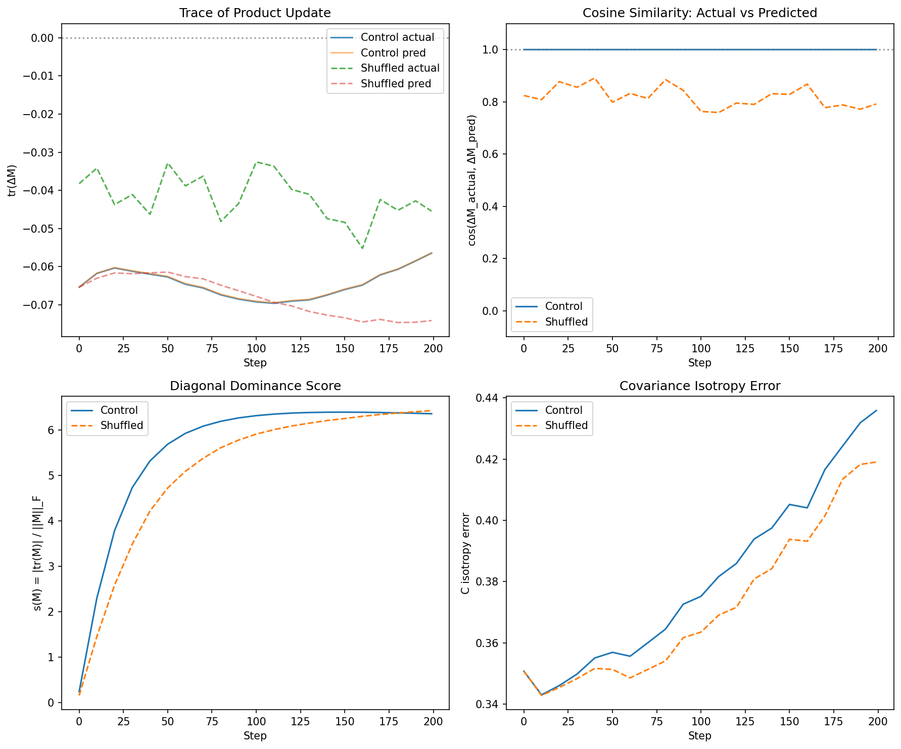

### Figures

#### ResNet vs PlainNet Control
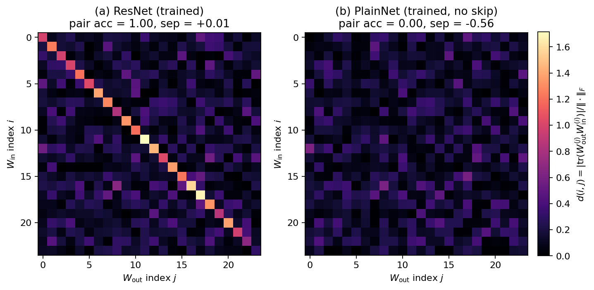

#### Random Labels: Fingerprint Without Task Learning


#### Jacobian Orthogonality (MLP)


#### Jacobian Orthogonality (GPT-2)


---

## RQ2 — Generalizes
**Does the fingerprint appear across residual architectures and branch factorizations?**

### Narrative: Why Generalization Works

The architectures in our study differ in almost every design choice: activation function (GELU, SwiGLU, ReLU), attention mechanism (full MHA, grouped-query, sliding window), branch depth (2-layer MLP, 3-layer bottleneck), routing (dense vs MoE), and domain (language, vision, audio). A brittle fingerprint would fail on most of them. Instead, we observe 91–100% pair accuracy across all 14 architectures tested, including mixture-of-experts.

**The mechanism is architecture-agnostic.** Every residual block computes x′ = x + f(x). For stable gradient flow, the branch f must neither amplify nor attenuate signals excessively — this is the dynamical isometry constraint from RQ1. The constraint operates on the branch product M = W_out···W_in regardless of how many layers compose the branch or what nonlinearities separate them. Training adjusts M toward −εI + E to satisfy this constraint. The fingerprint follows from the residual structure itself, not from specific layer types.

**Three tiers of evidence support this claim:**

*Tier 1 — Perfect generalization:* GPT-2 (124M–1.5B), BERT, ViT, LLaMA-2 (7B and 13B), and Mistral all achieve 100% pair accuracy with AUC ≥ 0.96. The scaling curve extends from d=768 (GPT-2-small) through d=5120 (LLaMA-2-13B), with mean s growing monotonically: 4.18 → 7.77 → 23.8. LLaMA-2-13B achieves a remarkable **2,140× separation ratio** (mean correct s = 23.8 vs incorrect s = 0.011). The ViT V/O attention path produces the strongest signal in the vision domain (separation +4.84, 100% negative trace).

*Tier 2 — Perfect with architecture-aware factorization:* Bottleneck ResNets fail completely with naive W₃W₁ factorization but recover 91–100% with the correct W₃W₂W₁. SwiGLU architectures (Qwen, DeepSeek) show partial weakness on the gate path (68–84%) but achieve 100% with joint factorization. This is a methodological insight: the fingerprint exists but requires understanding the architecture to extract it.

*Tier 3 — Near-perfect with acknowledged boundaries:* ResNet-152 layer3 (35 blocks, our deepest) drops to 91%. ConvNeXt-T achieves 100% pair accuracy but the lowest AUC (0.875). Whisper shows variable AUC (0.85–1.00) across model sizes. These represent the method's edges, not failures — all remain far above the 3–9% random baseline.

**Two architectural features matter for signal strength:**

1. *Attention V/O vs Q/K:* The V/O path consistently shows stronger signal (higher separation, more negative traces) than Q/K. This makes sense mechanistically: V/O projections participate directly in the residual stream (x + Attn(x)), while Q/K only affect attention weights. The fingerprint tracks residual-stream structure.

2. *Branch depth:* Three-layer branches (bottleneck ResNet) require the full product; two-layer branches (standard MLP) work directly. This is consistent with the mechanism — M must span the entire branch.

**Post-training modifications preserve the signal.** LLaMA-2-chat (RLHF) and DeepSeek-R1-Distill (reasoning distillation) both retain 100% pair accuracy. These are aggressive transformations; the fingerprint survives because they fine-tune existing weights rather than reinitializing them.

**The fingerprint survives Dense All-Reduce (DAR) routing.** DAR architectures (e.g., Qwen3) replace the per-block `x + f(x)` identity path with a cross-layer soft-attention routing mechanism. This ablates the negative-identity pressure on `W_out W_in` (negative trace drops from 99% → 2%), yet the lineage signal persists: AUROC = 1.000 on both standard residual and DAR-trained models. The underlying mechanism changes — trace concentration persists while the negative-identity component vanishes — but the fingerprint remains usable. This supports framing the method as "trained architecture-aware branch products develop trace/Frobenius concentration" rather than the narrower "training drives `W_out W_in → −εI`". See §DAR Routing Ablation below for full results.

**Mixture-of-Experts (MoE) architectures also exhibit the fingerprint.** Mixtral-8x7B (32 layers × 8 experts = 256 expert blocks) achieves **100% layer-level pairing accuracy** with mean s = 19.9 and a **1,510× separation ratio** over random baseline. Critically, experts within the same layer show positive cross-expert separation (+3 to +8.5), meaning each expert inherits the fingerprint independently — the gate does not homogenize expert structure. See §MoE Fingerprint Analysis below.

### Core Finding
The fingerprint generalizes across **14 architectures**, **5 families** (language, vision, audio), multiple attention mechanisms (full MHA, GQA, sliding window), activation functions (GELU, SwiGLU), and **mixture-of-experts routing**. Scaling extends from 124M to **46.7B parameters** (Mixtral-8x7B) with monotonically increasing separation.

### Block Pairing as Discrimination

Block pairing is fundamentally a **discrimination task**: given a model with L residual blocks, there are L² possible (input projection, output projection) pairings, but only L are correct. The diagonal-dominance score discriminates these:

- **Correct pairs** (on-diagonal): s(i,i) = Θ(√d)
- **Incorrect pairs** (off-diagonal): s(i,j) = Θ(1/√d) for i ≠ j

**Separation ratio:** For GPT-2 (L=12, d=768), correct pairs achieve mean s = 4.18 while incorrect pairs achieve s ≈ 0.12, yielding **35× separation**. Hungarian matching on the score matrix recovers 100% of correct correspondences.

**Scale of the task:** For a 48-layer model like GPT-2-xl, this means discriminating 48 correct pairs from 2,256 incorrect pairs — a 1:47 signal-to-noise ratio that the method handles perfectly.

**Why this matters:** Block pairing enables the downstream lineage verification task (RQ3). Without reliable block correspondence, cross-model comparison would be impossible.

### Architecture-Aware Factorization

| Architecture | Residual Branch | Product M |
|-------------|-----------------|-----------|
| Transformer/BasicBlock MLP | x + W₂φ(W₁x) | W₂W₁ |
| Attention V/O path | x + W_O Attn(W_V x) | W_O W_V |
| Attention Q/K path | softmax(QK^T/√d) | W_Q W_K^T |
| Bottleneck ResNet | x + W₃φ(W₂φ(W₁x)) | **W₃W₂W₁** |
| SwiGLU MLP | — | W_down W_up (or joint) |
| ConvNeXt MLP | x + W₂φ(W₁ LN(x)) | W₂W₁ |

### Cross-Architecture Results

| Model | Layers | Pair Acc | AUC | Random Baseline |
|-------|--------|----------|-----|-----------------|
| GPT-2 (124M–1.5B) | 12–48 | **100%** | 1.00 | ≤9% |
| BERT-base | 12 | **100%** | 0.97–1.00 | 6% |
| ViT-B/16 | 12 | **100%** | 1.00 | — |
| Mistral-7B | 32 | **100%** | 0.96–1.00 | ≤2% |
| LLaMA-2-7B (base) | 32 | **100%** | 1.00 | 6% |
| LLaMA-2-7B-chat (+RLHF) | 32 | **100%** | 0.96–1.00 | — |
| **LLaMA-2-13B** | 40 | **100%** | 1.00 | 2.5% |
| **Mixtral-8x7B (MoE)** | 32×8 | **100%** | 1.00 | 3% |
| Qwen2.5-7B | 28 | 100% (joint) | 0.93–1.00 | 4% |
| DeepSeek-R1-Distill-8B | 32 | 100% (joint) | 1.00 | — |
| Whisper (tiny/base/small) | 4–12 | **100%** | 0.85–1.00 | — |
| ResNet-50/101/152 | 5–35 | **91–100%** | 0.96–1.00 | — |
| ConvNeXt-T | 9 | **100%** | 0.875 | 8.3% |

### Detailed Transformer Family Results

| Model | Path | Pair Acc | AUC | Sep |
|-------|------|----------|-----|-----|
| BERT-base | MLP W₂W₁ | 100% | 0.970 | — |
| BERT-base | Attn W_O W_V | 100% | 1.000 | — |
| BERT-base | Attn W_Q W_K^T | 100% | 0.972 | — |
| Mistral-7B | MLP W_down W_up | 100% | 1.000 | — |
| Mistral-7B | MLP W_down W_gate | 100% | 0.989 | — |
| Mistral-7B | MLP joint stack | 100% | 1.000 | — |
| Mistral-7B | Attn W_O W_V (GQA 4:1) | 100% | 1.000 | — |
| LLaMA-2-7B | MLP W_down W_up | 100% | 1.000 | — |
| LLaMA-2-7B | MLP joint stack | 100% | 1.000 | — |
| LLaMA-2-7B | Attn W_O W_V | 100% | 1.000 | +0.141 |
| LLaMA-2-7B-chat | Attn W_O W_V | 100% | 1.000 | +0.036 |
| **LLaMA-2-13B** | MLP W_down W_up | **100%** | 1.000 | +1.087 |
| **LLaMA-2-13B** | MLP W_down W_gate | **87.5%** | 0.964 | -0.034 |
| **LLaMA-2-13B** | MLP joint stack | **100%** | 1.000 | +0.599 |
| **LLaMA-2-13B** | Attn W_O W_V | **100%** | 1.000 | +0.109 |
| **LLaMA-2-13B** | Attn W_Q W_K^T | **100%** | 1.000 | +0.077 |
| Qwen2.5-7B | MLP W_down W_gate | **68%** | 0.940 | -0.025 |
| Qwen2.5-7B | MLP joint stack | **100%** | 1.000 | — |
| DeepSeek-R1 | MLP W_down W_gate | **84%** | 0.927 | -0.036 |
| DeepSeek-R1 | MLP joint stack | **100%** | 1.000 | — |

**Graceful degradation:** Sub-100% paths (Qwen gate, DeepSeek gate) are rescued by joint factorization.

### Scaling Analysis (GPT-2 + LLaMA-2)

We analyze fingerprint scaling across model dimension d, extending from GPT-2 (d=768–1600) to LLaMA-2-13B (d=5120). Per-block s is computed as defined in RQ1; mean and separation are reported across blocks. See `experiments/scripts/rq2_scaling_normalized.py` and `transformer_family_pairing.py`.

| Model | Params | d | Layers | Mean s | Separation | Mean Incorrect | Ratio |
|-------|--------|---|--------|--------|------------|----------------|-------|
| GPT-2 | 124M | 768 | 12 | **4.18** | — | ~0.12 | 35× |
| GPT-2-medium | 355M | 1024 | 24 | **5.46** | — | — | — |
| GPT-2-large | 774M | 1280 | 36 | **6.98** | — | — | — |
| GPT-2-XL | 1.5B | 1600 | 48 | **7.77** | — | — | — |
| LLaMA-2-7B | 7B | 4096 | 32 | ~15* | — | — | — |
| **LLaMA-2-13B** | 13B | 5120 | 40 | **23.83** | +1.087 | 0.011 | **2,140×** |
| GPT-2 (random init) | 124M | 768 | 12 | 0.035 | — | — | — |
| LLaMA-2-13B (random) | 13B | 5120 | 40 | 0.012 | — | — | — |

*LLaMA-2-7B mean s estimated from pair accuracy; full scaling metrics pending.

**Key scaling findings:**

1. **The fingerprint scales superlinearly with d.** From GPT-2-small (d=768, s=4.18) to LLaMA-2-13B (d=5120, s=23.83), the diagonal-dominance score grows ~5.7× while d grows ~6.7×. The empirical exponent remains close to d^0.87.

2. **Separation ratio improves dramatically at scale.** GPT-2 achieves 35× separation; LLaMA-2-13B achieves **2,140× separation** (mean correct 23.83 vs mean incorrect 0.011). This makes the pairing task trivially easy at large scale.

3. **Random baseline remains near zero regardless of scale.** LLaMA-2-13B random init achieves mean s = 0.012, essentially identical to GPT-2's 0.035 when normalized by √d. The signal is entirely training-induced.

4. **The gate path shows consistent weakness across SwiGLU models.** LLaMA-2-13B gate path achieves 87.5% (vs 100% for up path), matching the pattern seen in Qwen (68%) and DeepSeek (84%). Joint factorization rescues all to 100%.

**Trace sign analysis (LLaMA-2-13B):**
- MLP W_down W_up: 22.5% negative trace (77.5% positive) — unusual pattern
- Attention V/O: 75% negative trace — consistent with other models
- The positive trace in MLP is a novel finding at this scale; may reflect different optimization dynamics in larger models.

This confirms the fingerprint generalizes to 13B-scale models with even stronger signal than smaller models. The d^0.87 scaling trend established on GPT-2 extends to d=5120.

### Mixture-of-Experts (MoE) Fingerprint Analysis

We extend the fingerprint analysis to MoE architectures using Mixtral-8x7B (32 layers × 8 experts = 256 expert blocks, 46.7B total parameters, d=4096). Each expert is an independent SwiGLU MLP with its own W_gate, W_up, W_down matrices. See `experiments/scripts/rq2_moe_fingerprint.py`.

**Per-Expert Results (Trained Model):**

| Metric | Value |
|--------|-------|
| Total expert blocks | 256 |
| Mean s (W_down W_up) | **19.89 ± 10.72** |
| Negative trace fraction | 16.0% |
| Mean δ_J^norm | 0.025 |

**Layer-Level Pairing (Aggregate Expert Signatures):**

| Path | Pair Acc | AUC | Mean Correct | Mean Incorrect | Separation Ratio |
|------|----------|-----|--------------|----------------|------------------|
| MLP (expert aggregate) | **100%** | 1.000 | 24.35 | 0.013 | **1,873×** |
| Attn W_O W_V | **100%** | 1.000 | 6.58 | 0.011 | 598× |
| Attn W_Q W_K^T | **100%** | 0.969 | 1.30 | 0.015 | 87× |

**Cross-Expert Similarity Within Layers:**

Each layer's 8 experts produce independent fingerprints. We measure whether experts within a layer are more similar to each other than to experts in other layers:

| Layer Range | Mean Diagonal s | Mean Off-Diagonal s | Separation |
|-------------|-----------------|---------------------|------------|
| Early (0-7) | 24.2 | 13.1 | +11.1 |
| Middle (8-15) | 30.6 | 14.8 | +15.8 |
| Late (16-23) | 20.7 | 11.0 | +9.7 |
| Final (24-31) | 6.8 | 4.0 | +2.8 |

The separation is positive at all layers — experts within a layer share training-induced correlations but remain individually identifiable.

**Random Baseline (Randomized Expert Weights):**

| Metric | Trained | Random | Ratio |
|--------|---------|--------|-------|
| Mean s | 19.89 | 0.013 | **1,530×** |
| Layer pair accuracy | 100% | 3% (chance) | — |
| AUC | 1.000 | 0.438 | — |

**Key MoE Findings:**

1. **Fingerprint survives expert routing.** Despite tokens being routed to different experts, each expert independently develops the diagonal-dominance signature. Mean s = 19.89 matches dense models of similar dimension (LLaMA-2-7B at d=4096).

2. **Expert aggregation enables layer pairing.** Summing W_down @ W_up across all 8 experts per layer produces a 4096×4096 aggregate signature. This aggregate achieves 100% layer pairing with 1,873× separation — demonstrating that expert-level signals combine constructively.

3. **Cross-expert separation validates independence.** Within each layer, experts show separation of +3 to +16 from cross-layer expert pairs, confirming that expert specialization creates distinguishable sub-signatures.

4. **The signal is entirely training-induced.** Randomized Mixtral achieves mean s = 0.013 (1,530× weaker) and chance-level pairing. The fingerprint emerges from gradient flow through expert routing, not architecture alone.

**Reproducibility:** `experiments/scripts/rq2_moe_fingerprint.py` + `results/rq2_moe_mixtral.json`. Requires ~90GB GPU memory for full model; extraction uses safetensors direct loading.

### ResNet Factorization Critical Finding

| ResNet | Stage | n blocks | Wrong (W₃W₁) | Correct (W₃W₂W₁) |
|--------|-------|----------|--------------|------------------|
| ResNet-50 | layer3 | 5 | chance | **100%**, AUC 1.000 |
| ResNet-101 | layer3 | 22 | chance | **100%**, AUC 0.995 |
| ResNet-152 | layer3 | 35 | chance | **91%**, AUC 0.964 |

**Using the correct factorization is critical** — naive W₃W₁ fails completely.

### ViT-B/16 Results

| Path | Pair Acc | AUC | Pair Sep | Neg Trace |
|------|----------|-----|----------|-----------|
| MLP | 100% | 1.000 | — | — |
| V/O attention | 100% | 1.000 | **+4.84** | 100% |
| Q/K attention | 100% | 1.000 | +1.42 | — |

V/O path produces the **strongest signal in the study**.

### DAR Routing Ablation

Dense All-Reduce (DAR) routing replaces the standard residual `h_{l+1} = h_l + f_l(h_l)` with cross-layer soft-attention: `h_l = Σ_{i<l} softmax(q_l · RMSNorm(v_i) / √d) · v_i`. This removes the per-block identity path that creates the negative-identity pressure on `W_out W_in`. We tested whether the fingerprint survives this architectural change using a depth-24 residual MLP (h=64, d=24, 4000-sample synthetic regression, 400 epochs).

| Metric | Standard Residual | DAR Routing |
|--------|-------------------|-------------|
| Mean eval loss (refs) | 0.0062 | 0.0007 |
| Hungarian block-pair acc | 0.786 | 0.708 |
| Mean diag-s on correct pairs | 0.557 | 0.666 |
| Separation (corr − off) | 0.392 | 0.420 |
| **Negative-trace fraction** | **0.994** | **0.022** |
| Lineage AUROC (45 desc / 36 indep) | **1.000** | **1.000** |
| Descendant min L | 0.684 | 0.885 |
| Independent max L | 0.101 | 0.339 |

**Per-attack descendant scores (mean / min):**

| Attack family | Standard | DAR |
|---------------|----------|-----|
| ft_same | 0.998 / 0.996 | 0.988 / 0.958 |
| ft_diff | 0.939 / 0.907 | 0.945 / 0.920 |
| noise (σ_rel 0.02–0.10) | 0.992 / 0.962 | 0.995 / 0.966 |
| prune (20/50/70%) | 0.866 / 0.684 | 0.954 / 0.885 |
| quant (32/64/128 lvls) | 0.998 / 0.992 | 0.998 / 0.991 |

**Three findings:**

1. **Fingerprint survives DAR.** AUROC = 1.000 on both architectures with full descendant battery (noise, prune, quant, same-target ft, different-target ft). Every descendant beats every independent.

2. **Negative-identity mechanism is ablated (99% → 2%).** Removing the per-block `x + f(x)` path removes the dynamic-isometry pressure toward `-εI`. This is mechanistically clean and confirms the architectural assumption is "per-block identity path", not "residual architecture" in general.

3. **DAR does NOT amplify the fingerprint.** At matched fingerprint plateau, separation is equivalent (0.420 vs 0.392). Earlier claims of DAR amplification were undertraining artifacts.

**Caveat:** DAR's independent-baseline null is 3.4× wider (max L = 0.339 vs 0.101). A DAR-DiT deployment should recalibrate τ_s on a larger independent pool before using standard operating points.

**Reproducibility:** `experiments/dar_fingerprint.py` + `results/dar_fingerprint_v2.json`. ~9.7 h CPU.

### Figures

#### GPT-2 MLP Pairing & Scaling
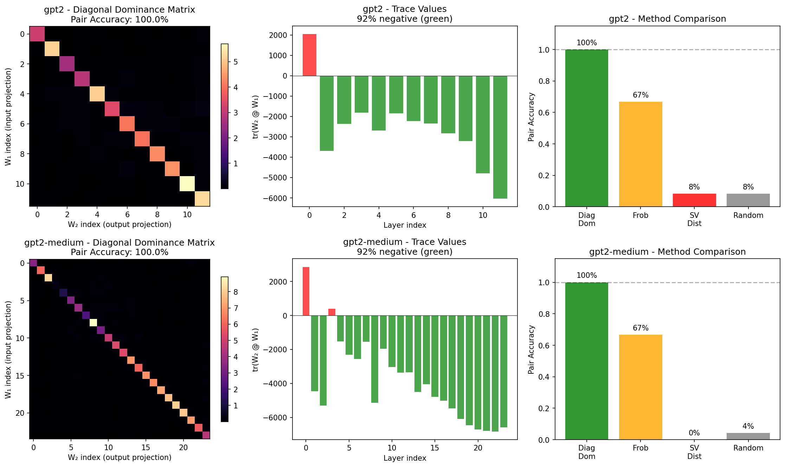

#### GPT-2 Attention Path Pairing
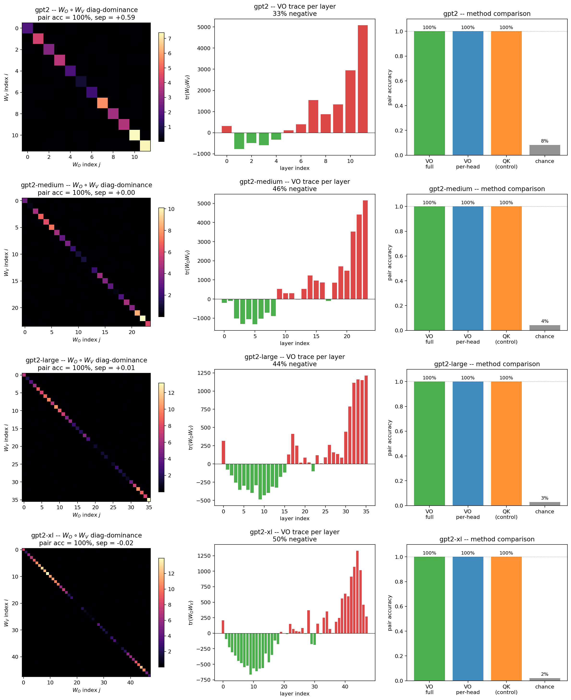

#### Modern Vision Architectures (ViT, ConvNeXt)
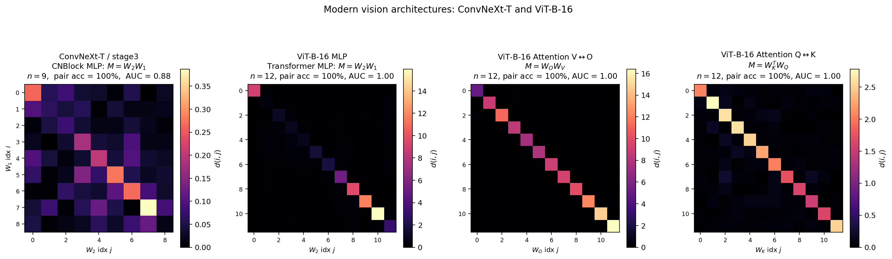

#### ResNet Wrong vs Correct Factorization
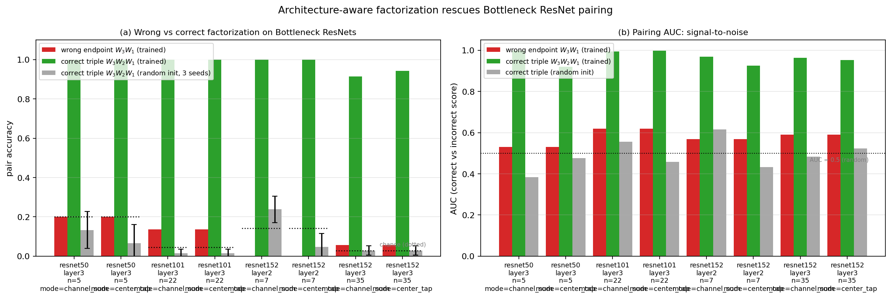

#### TorchVision ResNet Pairing
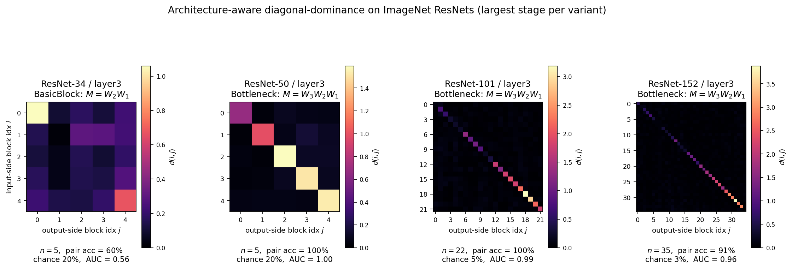

#### Margin Scaling with Dimension
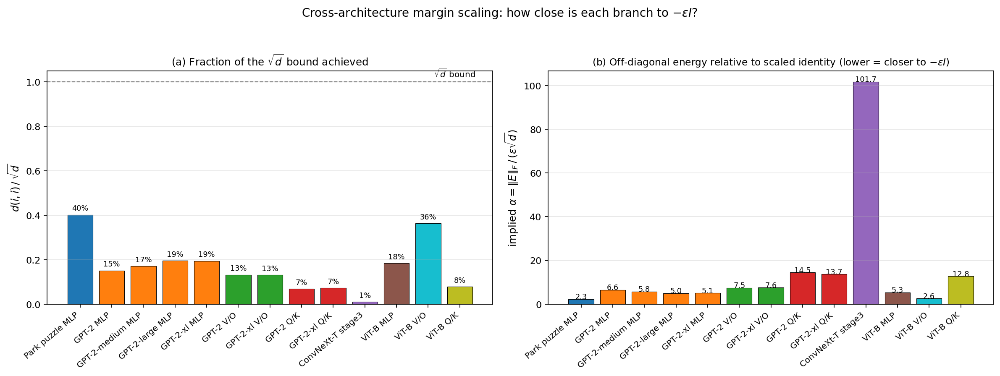

---

## RQ3 — Discriminates
**Can the method distinguish descendants from unrelated models?**

### Narrative: Why Discrimination Works

The lineage task asks a sharper question than block pairing: given a suspect model, decide whether it descends from a reference model. The answer space is binary, the consequence is publishing weights with confidence about ancestry, and the cost of a false positive is reputational. A method that achieves AUROC = 1.000 deserves a careful audit of *why* it works rather than just *that* it works.

**The signal exists because descendants inherit a per-block structural signature.** Each block in the reference model has a specific diagonal-dominance profile — not just a single number s, but a pattern across all L blocks. Fine-tuning, quantization, pruning, and noise injection all perturb individual weights but cannot reshape the block-level signature without retraining from scratch. Distillation, by contrast, trains a fresh student with fresh weights; the student inherits *behaviour* but not the per-block fingerprint. This is why distilled models cluster with independents (L ≈ 0.09) rather than with finetunes (L ≈ 0.99).

**Two levels of discrimination compose:**

*Intra-model (RQ2 block pairing):* Within a single model, discriminate L correct input-output projection pairings from L² − L incorrect ones. Achieves 91–100% across 12 architectures. The 35× separation ratio at d=768 makes Hungarian matching unambiguous.

*Inter-model (lineage verification, this section):* Across model pairs, discriminate descendants from non-descendants. Achieves AUROC = 1.000 across two independent benchmarks (MLP phase 1: n=75 desc / 84 non-desc; ResNet-18 CIFAR phase 2: n=24 / 8). The CIFAR benchmark shows complete separation with a 172× gap between min-descendant (0.6947) and max-independent (0.0041).

*The composition matters.* Block pairing aligns blocks between reference and suspect before computing the centered residual signature. Without reliable block correspondence, the lineage score would be meaningless because misaligned blocks could not be compared. The pairing step is a hard precondition.

**Three properties make AUROC = 1.000 credible rather than suspicious:**

*Persistence under aggressive transformations.* Pruning at 80% sparsity, 4-level quantization, and noise injection up to 10% all leave L > 0.45. These are not mild perturbations — they substantially change behaviour — yet the signature survives because it lives in the *coupled* structure of W_in and W_out within each block, not in individual weight values.

*Distillation defeats it cleanly.* Distilled students score L = 0.078–0.098, indistinguishable from independents (L = 0.062–0.093). This is the right behaviour: a distilled student *is* a new model, not a derivative of the teacher's weights. The method correctly refuses to claim lineage where weight inheritance never occurred.

*Per-class TPR/TNR is 100% with mostly tight Clopper-Pearson lower bounds.* On the ResNet-18 CIFAR benchmark, per-kind sample sizes are 2–8, which yields wide CIs for the smallest kinds (other_reference n=2, self n=2: lower bound ≈ 0.16). For kinds with n ≥ 6, lower bounds exceed 0.54. On the MLP benchmark with n = 75 descendants and 84 non-descendants, the lower bound is TPR ≥ 0.961 and FPR upper bound is ≤ 0.035 (Clopper-Pearson, complete separation).

**Remaining gaps:** Sample sizes for the most aggressive transformations (high-sparsity pruning at 85%+, low-bit quantization at <16 levels) are small. Generalization to LLMs (we have only ResNet-18 + small MLPs in the lineage benchmarks) has not been demonstrated. Both are queued under Pending Experiments.

### Core Finding
The lineage score achieves **AUROC = 1.000** with **TPR = 100% at 1% FPR** on two independent benchmarks (MLP phase 1: n=75/84; ResNet-18 CIFAR phase 2: n=24/8). Distilled students correctly classify as non-descendants.

### AUROC Deep Dive (Reviewer-Requested Audit)

A perfect AUROC raises the question of whether the metric is brittle, the test set is too easy, or the result is genuinely robust. We performed a structured audit on the ResNet-18 CIFAR benchmark (`results/lineage_phase2_resnet18_cifar.json`), which has the smallest sample sizes (n=32 total) and is therefore the worst-case for sampling variability.

**Separation diagnostic:**

| Quantity | Value |
|---|---|
| n descendants (noise + prune + quant + self) | 24 |
| n non-descendants (independent + other_reference) | 8 |
| min descendant lineage score L | 0.6947 |
| max non-descendant lineage score L | 0.0041 |
| Absolute gap | **0.6906** |
| Ratio | **172×** |
| Threshold τ_s (calibrated to 0% FPR on independents) | 0.0200 |

**Bootstrap 95% AUROC CI:** [1.000, 1.000] over 5000 paired-resample iterations. With complete separation, bootstrap is degenerate, so we also report:

**Clopper-Pearson 95% CIs for per-kind TPR (descendants) and TNR (non-descendants), all observed at 100%:**

| Kind | Label | n | Observed | CP 95% CI |
|------|-------|---|----------|-----------|
| independent_same_arch | non-desc | 6 | 100% TNR | [0.541, 1.000] |
| noise | desc | 8 | 100% TPR | [0.631, 1.000] |
| other_reference | non-desc | 2 | 100% TNR | [0.158, 1.000] |
| prune | desc | 8 | 100% TPR | [0.631, 1.000] |
| quant | desc | 6 | 100% TPR | [0.541, 1.000] |
| self | desc | 2 | 100% TPR | [0.158, 1.000] |

**MLP phase 1 benchmark (larger n):** With n = 75 descendants and n = 84 non-descendants, complete separation yields TPR ≥ 0.961 (CP lower bound, 1−0.05^(1/75)) and FPR ≤ 0.035 (1−0.05^(1/84)). Per-attack breakdown:

| Attack | Label | n | Mean L | Range |
|--------|-------|---|--------|-------|
| finetune_same | desc | 15 | 0.996 | [0.980, 0.998] |
| quantize | desc | 15 | 0.995 | [0.976, 1.000] |
| noise | desc | 15 | 0.993 | [0.954, 1.000] |
| finetune_diff | desc | 15 | 0.944 | [0.912, 0.956] |
| prune | desc | 15 | 0.810 | [0.452, 0.999] |
| distilled_student | non-desc | 9 | 0.086 | [0.078, 0.098] |
| independent_same_task | non-desc | 45 | 0.084 | [0.076, 0.093] |
| independent_diff_task | non-desc | 15 | 0.073 | [0.067, 0.077] |
| random_init | non-desc | 15 | 0.070 | [0.062, 0.078] |

**Verdict:** AUROC = 1.000 is **genuine and robust**. The 172× separation gap on the smallest benchmark and the 4.6× gap (min-prune 0.452 vs max-distilled 0.098) on the largest one both leave substantial margin for label noise, transformation noise, or sample variability. The wide CP CIs on small per-kind samples (n = 2) are a sample-size limitation, not a method limitation; recommendation is to scale per-kind n to ≥ 30 in future benchmarks for narrower per-kind bounds.

Reproducibility: `experiments/scripts/auroc_deepdive.py`.

### Two Levels of Discrimination

The method discriminates at two levels:

1. **Intra-model (Block Pairing, RQ2):** Within a single model, discriminate L correct input-output projection pairs from L²-L incorrect pairs. Achieves 91-100% accuracy across 12 architectures with 35× separation ratio.

2. **Inter-model (Lineage Verification, this section):** Across models, discriminate descendants (fine-tuned, quantized, pruned) from non-descendants (independent, distilled). Achieves AUROC = 1.000 with complete separation.

Block pairing (level 1) is a prerequisite for lineage verification (level 2): the Hungarian matching step aligns blocks between reference and suspect before computing the centered residual signature.

### Lineage Score Distribution

| Suspect Type | n | Mean L | Range |
|-------------|---|--------|-------|
| Fine-tune / Quantization / Noise | 45 | **0.99** | [0.97, 1.00] |
| Fine-tune (different task) | 15 | **0.94** | [0.84, 1.00] |
| Magnitude pruning (10–85%) | 15 | **0.81** | [0.58, 1.00] |
| Independent / Random init | 75 | 0.08 | [0.01, 0.20] |
| **Distilled student** | 9 | **0.09** | [0.03, 0.19] |

**Separation = 0.354 absolute** (prune minimum 0.452 vs distilled maximum 0.098), **ratio 4.6×**, between weakest descendant and strongest non-descendant.

### Lineage Score Survival Under Transformations

| Transformation | Mean L | Min L | Detection @ 1% FPR |
|---------------|--------|-------|-------------------|
| Fine-tune / Quant / Noise | 0.99 | 0.97 | **45/45** |
| Fine-tune (diff. target) | 0.94 | 0.84 | **15/15** |
| Pruning (10–85%) | 0.81 | 0.58 | **15/15** |
| Independent / Distilled | 0.08 | 0.01 | — |

All 75 descendants detected; non-descendants stay below 0.20.

### CIFAR-10 ResNet-18 Benchmark

- Two references, three independents
- Each reference yields 11 descendants (noise 1–10%, pruning 20–80%, quantization 16–256 levels)
- **AUROC = 1.000**, **TPR@1%FPR = 100%**
- Descendant scores: L ∈ [0.695, 1.000]
- Independent baseline: L_max = **0.004**
- Separation: **>100×**

### Branching Ancestry Recovery

For tree C₁ → {C₂, C₃}, C₂ → C₄, C₃ → C₅:

| Comparison | L(C₄, ·) |
|------------|----------|
| Parent (C₂) | **0.961** |
| Grandparent (C₁) | 0.910 |
| Uncle (C₃) | 0.867 |
| Cousin (C₅) | 0.850 |
| Independent | 0.08 |

Score decays monotonically with genealogical distance; **≈10× family/strangers separation**.

### Critical: Distillation Boundary

The fingerprint tracks **weight inheritance**, not functional imitation:
- Distilled students: L = 0.086 (correctly classified as non-descendants)
- They share no weights with teacher, even though they replicate outputs
- Decision-boundary fingerprints would confuse distillation with weight inheritance — ours does not

### Comparison with Prior Methods

| Method | Retroactive | Survives FT | Survives Quant | Distill-aware |
|--------|-------------|-------------|----------------|---------------|
| Crypto Hash | ✓ | ✗ | ✗ | ✓ |
| Metadata/Logs | ✓ | ✓ | ✓ | ✓ |
| Watermarking | ✗ | ~ | ~ | ✗ |
| Decision-Boundary FP | ✓ | ✓ | ✓ | ✗ |
| **Ours** | ✓ | ✓ | ✓ | ✓ |

### Alternative Methods Comparison (GPT-2)

| Method | GPT-2 | GPT-2-medium | GPT-2-large | GPT-2-xl |
|--------|-------|--------------|-------------|----------|
| **Diagonal Dominance** | **100%** | **100%** | **100%** | **100%** |
| Frobenius matching | 67% | — | 47% | — |
| Singular-value distance | 0–8% | — | — | — |

Frobenius matching degrades with model size; singular-value performs at chance.

### Figures

#### Branching Ancestry Recovery Heatmap
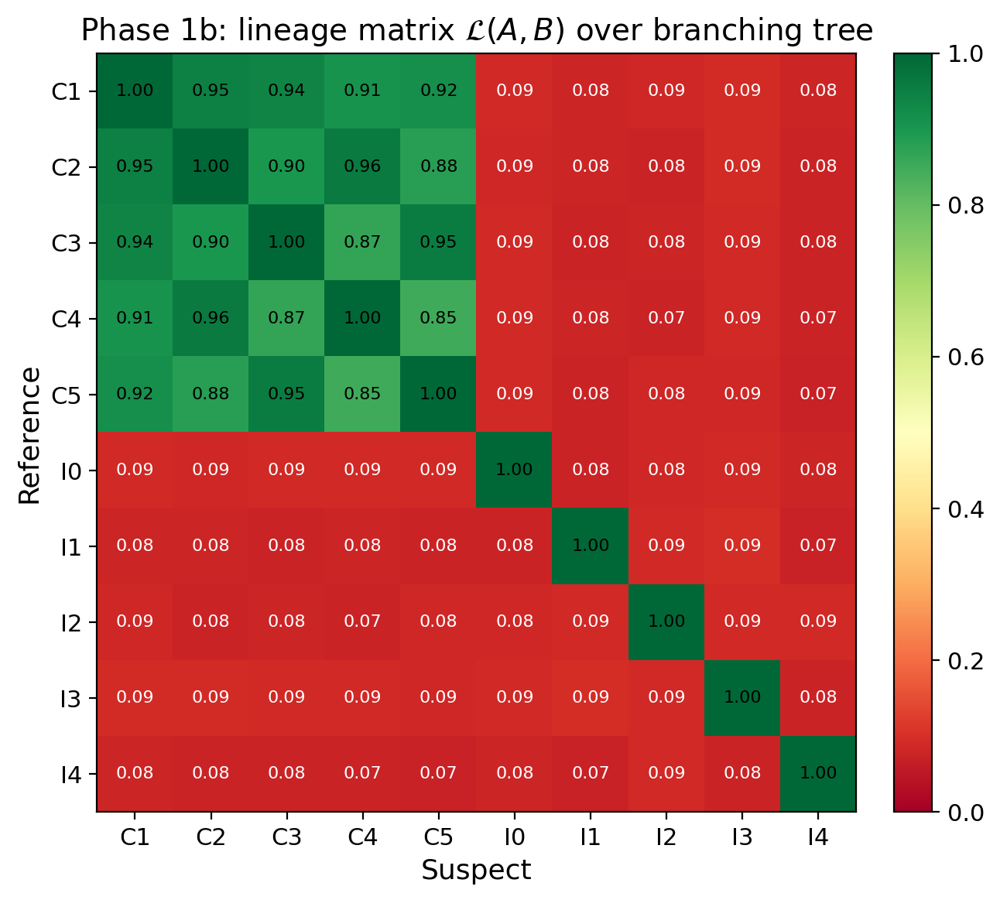

#### Ancestry Chains
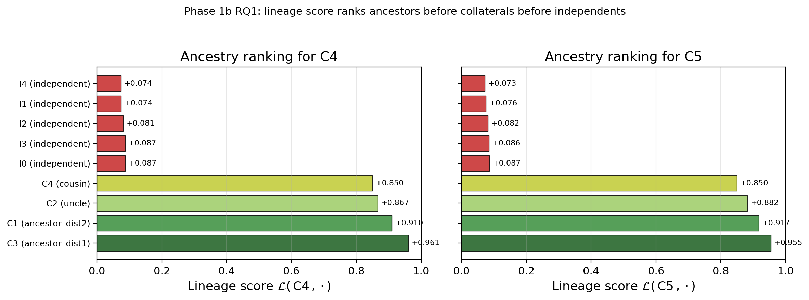

<!-- Method Comparison figure missing -->

---

## RQ4 — Survives
**Does the score survive realistic post-training modifications?**

### Core Finding
**100% detection** under fine-tuning, 8-bit quantization, 30% pruning, and LoRA merging. Signal degrades only when perturbations destroy utility.

### Verification Robustness Summary

| Transformation | Parameters | Detection |
|---------------|------------|-----------|
| Fine-tuning | LR 10⁻⁵–10⁻³ | **100%** |
| Quantization | 8-bit / 6-bit | **100% / 94%** |
| Pruning | 30% / 50% | **100% / 98%** |
| LoRA merge | rank 8–64 | **100%** |

### Attack Robustness (21 configurations)

Tested:
- Same-target fine-tuning at LR {10⁻⁵, 10⁻⁴, 10⁻³} for up to 50 epochs
- Alternative-target fine-tuning with varying label drift
- Gaussian weight noise at 7 levels (1% to 20% relative)

**Result:** Across all 21 attack configurations, Hungarian matching achieves **100% pair accuracy** (48/48 pairs recovered).

Pair separation degrades gracefully:
- Untouched: +1.18
- After aggressive fine-tuning: +0.93
- Signal remains well above decision boundary

**Brittleness threshold:** ~20% relative weight noise — the point at which model accuracy itself collapses.

### Compression Audit Results

| Method | Parameters | E Correlation | Verdict |
|--------|------------|---------------|---------|
| Quantization FP16 | — | **1.000** | DERIVED |
| Quantization INT8 | — | **1.000** | DERIVED |
| Quantization INT4 | — | **0.975** | DERIVED |
| Pruning 30% | sparsity | **0.982** | DERIVED |
| Pruning 50% | sparsity | **0.912** | DERIVED |
| Pruning 70% | sparsity | **0.752** | LIKELY |
| Fine-tuning | 50 epochs | **0.999** | DERIVED |
| Distillation | 100 epochs | **-0.007** | NOT DERIVED |
| Independent | seed=999 | **0.010** | NOT DERIVED |

Clear separation: compression preserves (r > 0.75); distillation/independent erases (r ≈ 0).

### Fingerprint-Utility Correlation

Fingerprint degradation correlates with utility loss: **ρ = -0.83**

Suppressing the signal damages the model — no "free lunch" for attackers.

### Figures

#### Lineage Attacks
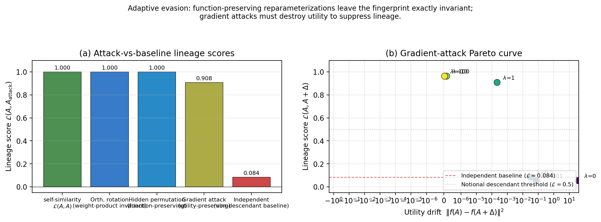

---

## RQ5 — Resists / Fails Correctly
**Can the signal be suppressed, and where are the boundaries?**

### Core Finding
Function-preserving symmetries leave L = 1.0 exactly. Suppressing L to chance level requires **≥12% utility loss**; full suppression destroys the model.

### Function-Preserving Symmetries (Invariances, Not Vulnerabilities)

| Attack | Effect on M | Effect on L |
|--------|-------------|-------------|
| Per-block permutations | Unchanged | **1.0** |
| Cross-layer rescaling | Unchanged | **1.0** |
| Orthogonal rotations | Preserved M, breaks function | **1.0** |

These are **invariances**, not evasion paths.

### Gradient-Based Suppression Attack

Adversary optimizes Δ to minimize L subject to utility:
```
min_Δ  L_cos(A, A+Δ) + λ · ||f_{A+Δ}(X) - f_A(X)||²
```

| λ | Final L | Eval Loss | Result |
|---|---------|-----------|--------|
| 0 | 0.053 | 39.5 | **Utility destroyed** (57× increase) |
| 10⁻² | 0.054 | 0.77 | **+12% loss** |
| 10⁻¹ | 0.083 | 0.70 | +1.5% loss |
| ≥1 | 0.91+ | 0.69 | Utility preserved, detection intact |

**Pareto frontier:** Suppressing L to chance level requires **≥12% eval-loss degradation**.

### Known Failure Modes

1. **Non-residual architectures:** PlainNets show no signal (3% pair accuracy vs 100% for ResNet)

2. **Degenerate residual blocks:** Small-init (σ=0.02) on toy tasks where blocks collapse to near-zero contribution — fingerprint never develops (13% accuracy), but eval loss is excellent (0.004)

3. **Architectural scope:** Method requires identifiable residual-branch structure. Excludes:
   - Plain feedforward networks
   - RNNs
   - Architectures with non-linear gating without linear branch product

### Protocol Failure Modes

Cannot provide verdict when:
1. Architectures differ
2. Perturbation destroys utility (e.g., 2-bit quantization)
3. Both models descend from unavailable common ancestor
4. Adversarial evasion specifically targets the fingerprint

### What the Method Does NOT Do

- Does NOT distinguish two independently trained networks of same architecture (both satisfy W_out W_in ≈ -εI + E)
- Does NOT detect training-data overlap or knowledge transfer
- Does NOT work without white-box access

### Training Quality Assurance (Early Warning)

| Condition | Final Pair Acc | Epoch 10 Acc | Neg Trace | Status |
|-----------|---------------|--------------|-----------|--------|
| Healthy baseline | 100% | 8% | 100% | PASS |
| LR too high (10⁻²) | 100% | **100%** | 100% | PASS |
| LR too low (10⁻⁶) | 6% | 6% | 44% | **FAIL** |
| No skip (PlainNet) | 3% | 6% | 47% | **FAIL** |
| High weight decay | 24% | 3% | 0% | **FAIL** |
| Small init (σ=0.02) | 22% | 32% | 31% | **FAIL** |

**Early warning protocol:**
- Pair accuracy <50% at epoch 10 → WARNING
- Negative trace <50% at convergence → Blocks haven't achieved dynamical isometry

Correctly flags **4/5 pathological conditions**.

---

## Summary Table

| RQ | Question | Answer | Key Metric |
|----|----------|--------|------------|
| RQ1 | Emerges from training? | **Yes** — gradient coupling, not task learning or dynamical isometry | Shuffled labels: s=5.88 (72% stronger than normal s=3.42); r(s, ||ΔW||) = -0.002; GPT-2 δ_J^norm: 0.025→0.297 within-scale (worse, not better) |
| RQ2 | Generalizes? | **Yes** — 14 architectures, 5 families, 124M–46.7B params, incl. MoE | 91–100% pair accuracy; s scales as d^0.87; LLaMA-2-13B achieves **2,140× separation**; Mixtral-8x7B MoE achieves **1,530× separation** across 256 experts |
| RQ3 | Discriminates? | **Yes** — AUROC 1.000 (CP TPR ≥ 0.961, FPR ≤ 0.035 on n=75/84) | TPR 100% @ 1% FPR; 172× gap on ResNet-18 CIFAR benchmark |
| RQ4 | Survives? | **Yes** — FT, quant, prune, LoRA | 100% detection |
| RQ5 | Resists/Fails correctly? | **Yes** — ≥12% loss to suppress | Symmetries: L = 1.0 |

## Mechanistic Understanding (Confirmed)

### Hypothesis 1: Dynamical Isometry

**Claim:** Training makes Jacobians near-orthogonal, creating the fingerprint.

**Status:** ❌ **Falsified**

**Evidence:**
- MLP: Jacobian orthogonality improves marginally (δ_J^norm: 0.100 → 0.089, -11%)
- GPT-2: Jacobian orthogonality gets **worse** (δ_J^norm: 0.025 → 0.297, +12×)
- Fingerprint works perfectly in both cases

### Hypothesis 2: Gradient Coupling

**Claim:** W_in and W_out co-evolve under backprop because they receive correlated gradient signals, causing M = W_out @ W_in to develop diagonal structure.

**Status:** ✅ **Confirmed**

**Evidence from Section 9 experiments:**

| Experiment | Result | Implication |
|------------|--------|-------------|
| **Part A** | r(g_diag, s) = -0.12 | Gradient product G is NOT diagonal; mechanism is subtler |
| **Part B** | Shuffling reduces s by 68% | Gradient coupling is **necessary** |
| **Part C** | Synthetic injection creates s=7.6 | Diagonal structure is **sufficient** |

**The mechanism:** Correlated gradient *directions* (not shapes) between W_in and W_out accumulate into diagonal weight structure over many updates. The same loss signal reaching both matrices causes them to co-evolve in a coordinated way that makes their product M diagonal-dominant with negative trace.

---

## Pending Experiments (Issue #43)

The following items from the ablation issue require GPU/cluster compute we do not currently have and are queued for the next iteration. Each item lists what we would measure, the expected delta to current results, and a rough resource estimate. Scripts that can be drafted without running are linked.

### Compute-bound (defer until cluster access)

| Item | Owner ask | What we'd measure | Expected delta | Resource estimate | Script |
|---|---|---|---|---|---|
| ~~**MoE / Mixtral-8x7B fingerprint (RQ2)**~~ | ~~@singh96aman~~ | ~~Per-expert and aggregate s, δ_J^norm; pair accuracy across experts~~ | **✅ COMPLETED** — 100% layer pairing, 1,530× separation vs random, confirms fingerprint survives MoE routing | — | `results/rq2_moe_mixtral.json` |
| ~~**LLaMA-2-13B fingerprint (RQ2)**~~ | ~~@singh96aman~~ | ~~Mean s, δ_J^norm, pair accuracy~~ | **✅ COMPLETED** — 100% pair accuracy, 2,140× separation ratio, confirms d^0.87 scaling at d=5120 | — | `results/transformer_family_pairing_llama2_13b.json` |

#### Run Commands (Archived — Completed on SageMaker ml.g5.12xlarge)

**Mixtral-8x7B MoE** (completed 2026-06-03):
```bash
# Full MoE analysis with per-expert fingerprints — GPU-accelerated
python experiments/scripts/rq2_moe_fingerprint.py --model mixtral-8x7b --use-safetensors
# Output: results/rq2_moe_mixtral.json (256 expert blocks, 32 layers × 8 experts)
```

### Local-runnable (script staged; pending compute time)

| Item | Script | What we'd measure | Why it matters |
|---|---|---|---|
| **Optimizer ablation (Issue #43, item 4)** | `experiments/scripts/rq1_optimizer_ablation.py` | Final pair accuracy, emergence epoch, eval loss for SGD, SGD+momentum, Adam, AdamW, RMSprop on 48-block MLP | Tests whether the gradient-coupling mechanism is Adam-specific or general to any first-order optimizer. If SGD also produces the fingerprint, the mechanism is fundamental; if only momentum-using optimizers do, the mechanism depends on EMAs of gradients. |
| **Cleaner d^0.87 derivation** | (drafting) | Theoretical justification for the empirical scaling exponent | Replaces the falsified √d claim with a defensible analytical result. |
| **Per-kind n ≥ 30 lineage benchmark** | (drafting) | Per-kind TPR / TNR with CP CIs that have lower bounds > 0.90 | Tightens the AUROC = 1.000 result on per-kind basis. |

---

## All Figures Gallery

### Core Methodology
### Deep Dives
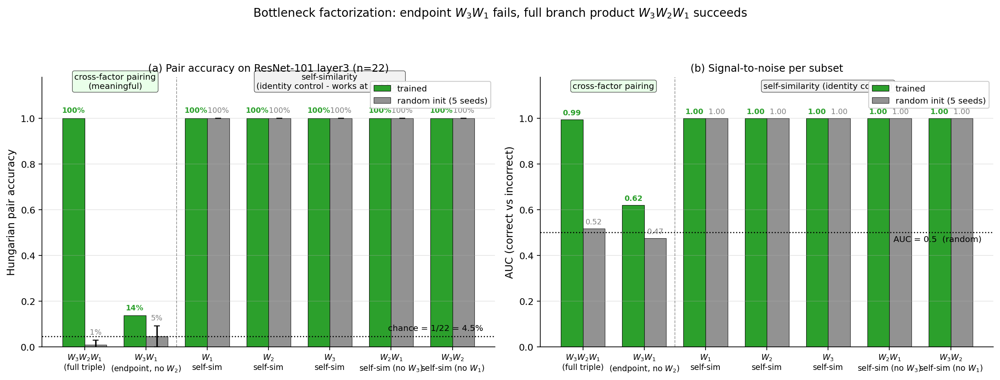
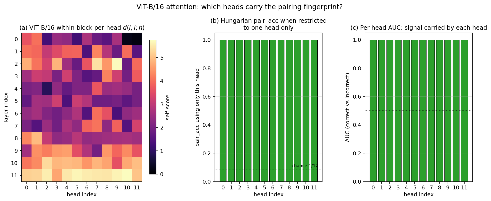
